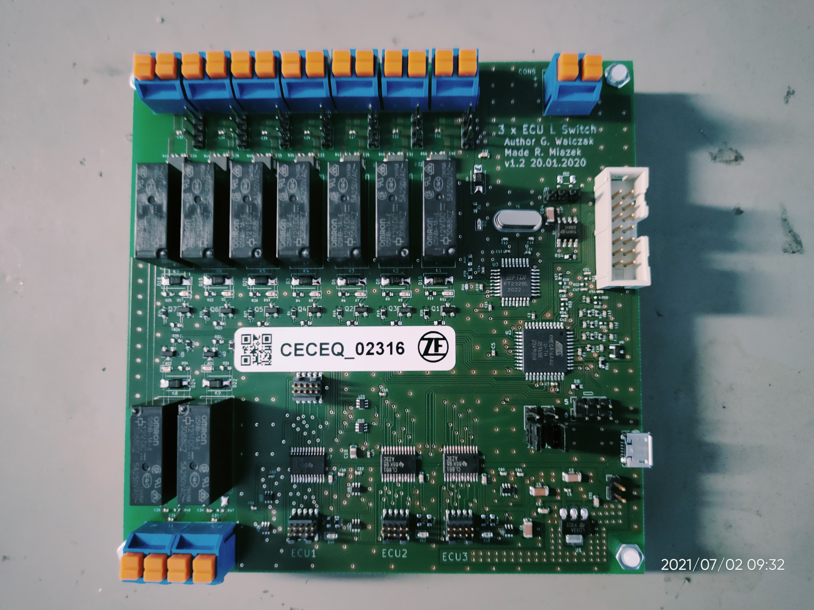
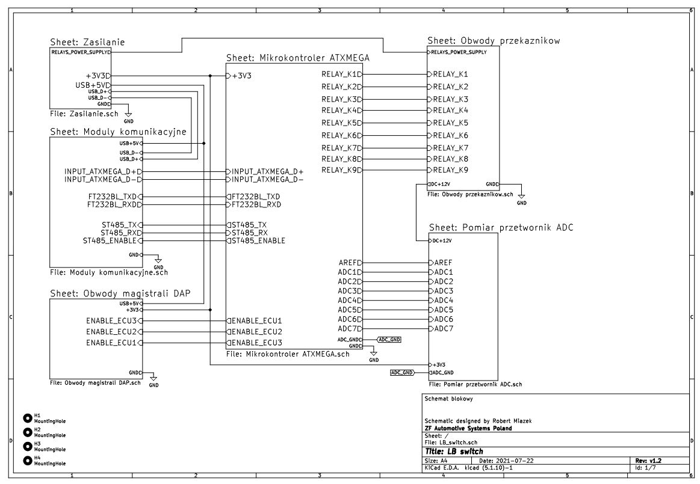

# LBswitch

Projects from automotive industry. Main feautre is switching debbuger between 3 different ECU modules (JTAG/DAP interface) and managing their supply. It is used remotely on software benches to test new revisions of SW. I was responsible for HW project, PCB assembly and integration modules on SW benches

## 📷 Zdjęcia

## ⚙️ Użyte komponenty
- ATXmega 16A4U

